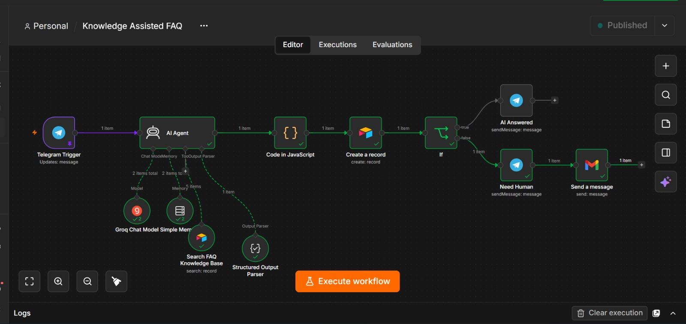

# Customer-Support AI Agent

A support assistant that answers approved customer questions, uses conversation memory, refuses to guess when information is unsupported, and routes unresolved questions toward human support.

## Problem

Customer-support teams repeatedly answer the same product, delivery and policy questions. When the answer is not in the approved information, an AI system must avoid inventing a response.

## What the system does

The Customer-Support AI Agent:

- Searches approved FAQ and support information
- Returns one grounded answer to known questions
- Uses memory to maintain conversational context
- Refuses to guess when the information is unsupported
- Routes unresolved questions toward human support

## Architecture

1. A customer submits a support question.
2. The agent searches the approved support information.
3. The relevant information is passed to the AI model.
4. The agent returns a grounded answer when a reliable answer exists.
5. Unsupported questions are refused or routed to human support.
6. The conversation context is retained where appropriate.

## Key design decision

The agent is restricted to approved support information. It is better to say “I’m not able to confirm that” and route the question to a human than to invent a price, policy, stock level or delivery promise.

## Failure handling and tests

The system was tested with:

- A known question with an approved answer
- A follow-up question requiring memory
- An unsupported question
- A question designed to make the agent guess
- A request that should be routed to human support

## Tech stack

- n8n
- Airtable
- OpenAI
- Approved FAQ and support information
- Conversation memory

### Workflow canvas

## Demo

[Watch the recorded walkthrough](https://youtu.be/cR0_Ga24kuw)

## Security note

This repository contains sanitized workflow files and test data. Credentials, customer records, passwords and live webhook URLs have been removed.
